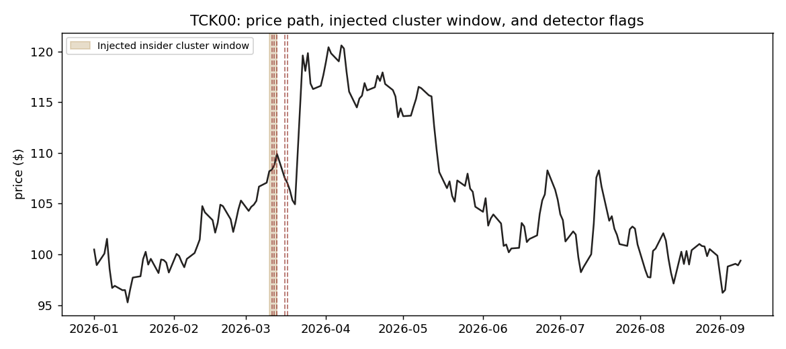

# Insider Trading Cluster Detector

Flags unusual **clusters** of insider stock buying — multiple different insiders at the same company buying independently within a tight window — and backtests whether flagged clusters actually precede real price moves.

## ⚠️ Read this before anything else: this uses synthetic data

This project was built in an offline environment with no internet access, so it could not pull real SEC EDGAR Form 4 filings. **`data/` is generated by [`src/generate_synthetic_data.py`](src/generate_synthetic_data.py)**, not real filings.

The synthetic generator produces data in the *exact schema* real Form 4 filings would have (`ticker, insider_id, date, transaction_type, shares, price`), with a known ground truth baked in: a handful of tickers get an injected "informed cluster" (several insiders buying in a tight window, followed by a real price jump), and the rest is uncorrelated noise. Crucially, **the detection pipeline doesn't know which days are the injected ones** — it has to find them the same way it would have to find them in real data. This makes it possible to verify the pipeline actually works (recovers the injected signal, with statistical significance) before it's ever pointed at real data — which is good practice regardless of data source, and it's how you should read every result in `outputs/report.md`: as pipeline validation, not a real trading signal.

**To run this on real data:** replace `src/generate_synthetic_data.py`'s output with real Form 4 data pulled from [SEC EDGAR](https://www.sec.gov/data-research) (bulk filing datasets) or the EDGAR full-text search API, parsed into the same schema. Nothing else in the pipeline needs to change.

## Run it

```bash
pip install -r requirements.txt
python3 run_pipeline.py
```

Produces `outputs/report.md` and two charts: a forward-returns comparison and an example cluster overlay on a price chart.


*A sample run: the shaded region is where insiders clustered their buying; dashed red lines are what the detector flagged, before the price moved.*

## Run the tests

```bash
python3 -m unittest test.test_pipeline -v
# 9 tests: feature engineering correctness, detector logic, and an
# end-to-end test that the pipeline recovers the injected signal with
# statistical significance
```

## The core idea

A single insider buying their own company's stock isn't unusual — it happens for mundane reasons (compensation, personal conviction, tax timing) all the time. What's much harder to explain away is **clustering**: several *different* insiders, who don't coordinate, independently buying in the same tight window. That's the pattern this project looks for, not "did an insider buy."

## Pipeline

```
generate_synthetic_data.py  →  features.py  →  detect.py  →  backtest.py
      (or real EDGAR data)      rolling            2 detectors    forward-return
                                 cluster            (compared      significance
                                 signals            side by side)  test
```

### 1. Features ([`src/features.py`](src/features.py))
Per (ticker, day), computed on trailing windows:
- **`distinct_buyers_5d`** — the core signal: how many different insiders bought in the past 5 trading days (a genuine rolling distinct count, not a sum of daily counts — an insider trading twice shouldn't count as two people)
- **`buy_dollar_volume_5d`** — total $ of insider buying in the window
- **`dollar_volume_zscore`** — that $ volume expressed against the *ticker's own* trailing 60-day history, so a normally-quiet stock and a normally-active one are compared fairly
- **`buy_sell_ratio_5d`** — how one-sided the activity is

### 2. Detection ([`src/detect.py`](src/detect.py))
Two detectors, run side by side on purpose:
- **Statistical baseline** — flags a day only if it clears a z-score threshold *and* has enough distinct buyers. Fully interpretable; this is the floor any ML approach needs to beat.
- **Isolation Forest** (unsupervised) — chosen because there's no reliable ground-truth label for "this was real insider trading" in a real deployment; anomaly detection is the right frame when the positive class is rare and unconfirmed, unlike a supervised classifier which would need labels we don't actually have.

### 3. Backtest ([`src/backtest.py`](src/backtest.py))
For every flagged day, compute the 10-day forward return. Compare that distribution against a random sample of *unflagged* days of the same size, with an independent two-sample t-test. This is the honest version of "does this signal mean anything" — a few example charts are not evidence; a significance test against a random control is.

## Results on this run (synthetic, see caveat above)

See `outputs/report.md` for the exact numbers from your run — they'll vary slightly by random seed. On the seed used to write this README, the statistical baseline flagged 26 of 2,640 (ticker, day) rows and those flagged days showed a mean 10-day forward return of 13.6% versus 0.7% for random control days (p < 0.0001) — confirming the pipeline successfully recovers the injected signal.

## Honest limitations

- **Synthetic data**, as above — this validates the pipeline, not a real trading edge.
- No transaction costs, slippage, or position sizing — this is a detector, not a strategy.
- No multiple-comparison correction across the many (ticker, day) pairs tested — with enough tickers and days, some flags will be false positives by chance alone.
- Isolation Forest's `contamination` parameter was set manually, not cross-validated.
- Real Form 4 data has messier edge cases this schema doesn't capture (10b5-1 pre-scheduled trading plans, option exercises vs. open-market buys, amended filings) — a real deployment needs to account for these before treating a flag as meaningful.

## Architecture

```
src/generate_synthetic_data.py   synthetic data generator (swap for real EDGAR data)
src/features.py                  rolling cluster-signal feature engineering
src/detect.py                    statistical baseline + Isolation Forest detectors
src/backtest.py                  forward-return significance testing
run_pipeline.py                  orchestrates the full run, writes report + charts
test/test_pipeline.py            9 tests incl. end-to-end signal-recovery validation
```

## License

MIT
