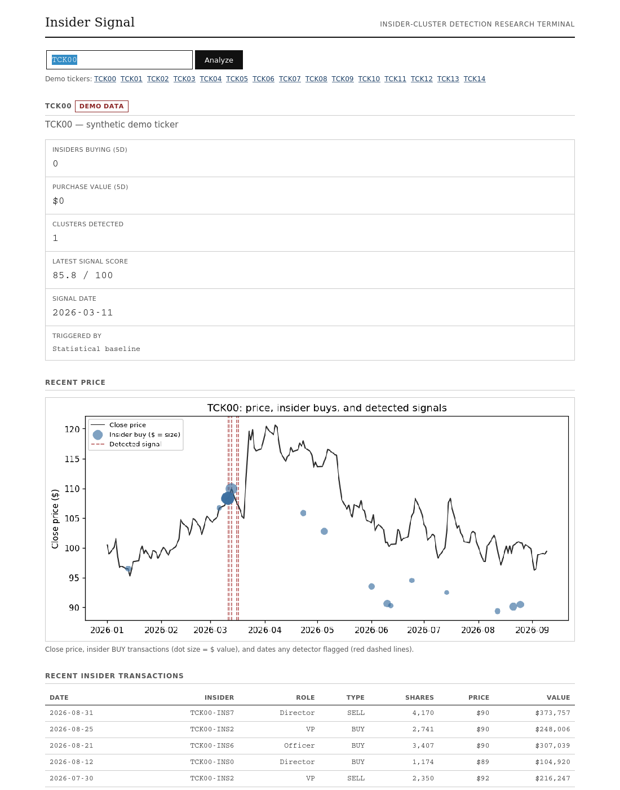
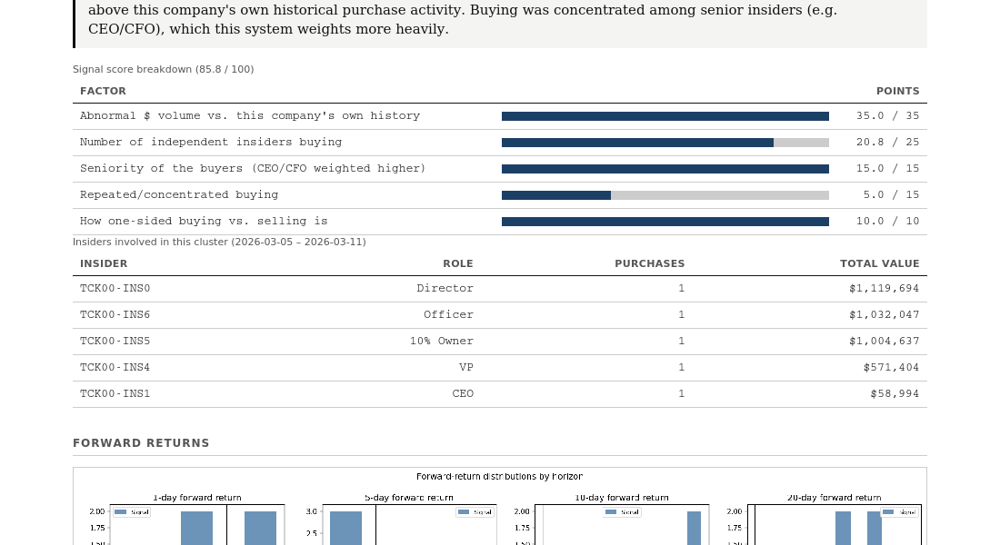

# InsiderSignal

Detects unusual clusters of insider stock buying in SEC Form 4 filings and tests, rigorously, whether those clusters actually precede price moves.

## Demo


*Ticker search over the demo dataset: recent price with insider buys and detected signals overlaid, plus summary stats.*


*Signal detail: an interpretable score breakdown and the specific insiders behind a detected cluster.*

## Problem

A single insider buying their own company's stock isn't unusual — it happens for mundane reasons (compensation, personal conviction, tax timing) constantly. What's harder to explain away is **clustering**: several *different* insiders, who don't coordinate, independently buying in the same tight window. This project looks for that pattern specifically, and — the part most similar projects skip — actually checks whether it means anything, with an out-of-sample backtest instead of a single retrospective demo.

## Approach

```
SEC Form 4 filings ──┐
                      ├──▶ cleaning ──▶ features ──▶ detectors ──▶ backtest ──▶ dashboard
synthetic generator ──┘        │            │             │            │
                          validate,    rolling      statistical    forward returns,
                          normalize,   windows,     baseline +     benchmark, costs,
                          document     z-scores,    Isolation      chronological
                          every drop   role         Forest         out-of-sample split
                                       weighting    (walk-forward)
```

Both data sources produce the same internal transaction schema, so everything from `cleaning` onward runs identically regardless of where the data came from.

## Data

- **Real** ([`src/edgar/`](src/edgar/)) — pulls actual Form 4 filings from SEC EDGAR: ticker→CIK resolution, filing listing, XML parsing, and classification of open-market buys vs. option exercises/grants/tax withholding. Requires a `EDGAR_USER_AGENT` environment variable (SEC policy — see Usage).
- **Synthetic** ([`src/generate_synthetic_data.py`](src/generate_synthetic_data.py)) — generates data with a *known* ground truth: a few tickers get an injected cluster of insider buying followed by a real price jump; the rest is noise. The detector doesn't see which days are injected, so recovering them is a genuine test of the pipeline, not a tautology. This is also the only way to run the detector end-to-end today, because:

**There is no real price-history source in this project.** Phase 1 added real Form 4 *transactions*; nothing fetches real prices. A real ticker typed into the dashboard gets a live, transactions-only SEC EDGAR lookup — informative, but not run through detection or backtesting, because there's no matching real price series to compute a return against. This is stated plainly everywhere it matters rather than papered over; see Limitations.

## Feature Engineering

Per (ticker, day), from a trailing window (default 5 days):

| Feature | What it captures |
|---|---|
| `distinct_buyers_5d` | how many different insiders bought — the core cluster signal |
| `buy_dollar_volume_5d` | total $ bought in the window |
| `dollar_volume_zscore` | that $ volume vs. this ticker's own trailing 60-day history |
| `buy_sell_ratio_5d` | how one-sided buying vs. selling is |
| `n_purchases_5d` / `purchases_per_buyer_5d` | trade count and concentration — repeated buying vs. one-off |
| `insider_relative_size_zscore_5d` | is this trade unusually large for *this specific insider*, not just the company |
| `role_weighted_buy_value_5d` | $ volume weighted by seniority (CEO/CFO weighted higher) |
| `pre_signal_return_10d` | the stock's own return leading into the signal (buying a dip vs. a run-up) |

Not implemented: purchase value relative to company size — this would need market cap or shares outstanding, which neither data source provides, and a closing price alone isn't a size proxy. Documented as a real gap rather than approximated with something misleading.

## Detection

Three approaches, compared on equal footing ([`src/compare.py`](src/compare.py)):

1. **Random baseline** — flags a matching fraction of days at random. Not a strawman; the floor the other two need to beat.
2. **Statistical baseline** ([`src/detect.py`](src/detect.py)) — flags a day only if it clears a z-score threshold (default 2.5) *and* has enough distinct buyers (default 3). Fully interpretable, conservative by design.
3. **Isolation Forest** — unsupervised (no reliable "this was real insider trading" label exists in production), trained on all features above. Two variants: a fast whole-dataset fit for quick illustration (has look-ahead leakage by construction — documented, never used for the reported backtest), and a **walk-forward** version that refits periodically on only strictly-prior data, which is what the backtest and dashboard actually use.

A 0–100 **signal score** ([`src/signal_score.py`](src/signal_score.py)) is a hand-specified, capped weighting of the features above (not a fitted model — fitting it to the synthetic ground truth would tune it to one generator's quirks instead of being readable by a person). Every score comes with a breakdown showing exactly which factors earned how many points.

## Backtesting

[`src/backtest_analysis.py`](src/backtest_analysis.py) — the rigorous evaluation layer:

- **Forward returns** at 1/5/10/20-day horizons, entered either at the signal date (`lag=0`, an optimistic upper bound) or 2 trading days later (the realistic case — Form 4 filings are legally due within 2 business days of the transaction, so that's the earliest a real trader could have known).
- **Benchmark**: an equal-weighted average return across every ticker in the universe over the same dates — there's no real index to compare a synthetic universe against, so this is stated as what it is, not dressed up as "the market."
- **Transaction costs**: configurable basis-point cost + slippage, round-trip.
- **Chronological train/test split** — never a random shuffle. Nothing is currently tuned on the development period (every threshold above is a fixed, documented judgment call, not fit from data), so the split exists as enforced discipline for when that changes.
- **Significance testing**: Welch's t-test against random out-of-sample control days, with sample sizes and a 95% confidence interval always reported alongside the p-value.

## Results

**Synthetic validation (single run, illustrative)** — `python3 run_pipeline.py`, seed 42, whole dataset at once: statistical baseline flagged 26/2640 (ticker, day) rows, mean 10-day forward return **+13.6%** vs. +0.7% control (p<0.0001); Isolation Forest (full-fit) flagged 80/2640, **+7.7%** vs. +0.0% (p<0.0001). This confirms the pipeline *can* recover an injected signal — it is not a claim about real-world performance, and Isolation Forest's number here has look-ahead leakage by construction (see Approach).

**Synthetic validation, out-of-sample (rigorous)** — `python3 run_backtest.py`, same seed, chronological 60/40 split, walk-forward Isolation Forest, realistic 2-day entry lag: statistical baseline (n=2 out-of-sample signals) mean return **-1.75%**, p=0.44; Isolation Forest walk-forward (n=19) mean return **+1.61%**, p=0.23. **Neither is statistically significant.** Root cause, verified rather than assumed: at this seed, zero of the 5 injected clusters happen to fall in the out-of-sample window (confirmed this varies 0–3/5 across other seeds — a real property of the generator's cluster-placement range interacting with the split, not a bug). Run with `--seed 3` instead, where 3/5 clusters do land out-of-sample, and both detectors are significant (p<0.0001, precision 0.88/0.64, recall 0.30/0.57) — reported here for transparency about what the methodology finds when there's something to find, not as "the" result.

**Real data**: no backtest results are reported on real SEC filings, because there is no real price series to compute a return against (see Data). The real ingestion pipeline is verified to work structurally end-to-end (parses actual fetched filings correctly, classifies transaction types correctly, flows through the same feature/detection code as synthetic data) — see `test/test_edgar.py` and `test/fixtures/`.

## Dashboard

```bash
python3 run_dashboard.py
# open http://127.0.0.1:5050
```

Enter a demo ticker (`TCK00`–`TCK14`, listed on the page) for the full analysis: recent price with insider buys and signals marked, recent transactions, detected clusters, a scored signal with a plain-language explanation built from that row's actual feature values, the insiders involved, and five charts (price/signals, forward-return distributions, historical signal performance, cumulative return vs. benchmark, detector comparison). All fully-analyzed data is synthetic demo data, labeled as such on the page. A real ticker attempts a live, transactions-only EDGAR lookup if `EDGAR_USER_AGENT` is configured, and falls back to a clear "try a demo ticker" message otherwise.

## Installation

```bash
git clone https://github.com/shishir0601/insider-signal.git
cd insider-signal
pip install -r requirements.txt
```

Requires Python 3.9+. No database, no external services required for the synthetic/demo path.

## Usage

```bash
python3 run_pipeline.py      # fast single-run synthetic report -> outputs/report.md + charts
python3 run_backtest.py      # rigorous out-of-sample backtest -> outputs/backtest/report.md + charts
python3 run_dashboard.py     # interactive dashboard at http://127.0.0.1:5050
```

For real SEC EDGAR data:

```python
from src.edgar.client import EdgarClient
from src.edgar.ingest import fetch_transactions_for_ticker
from src.cleaning import clean_transactions

client = EdgarClient(user_agent="YourName your@email.com")  # required by SEC policy — no default
raw = fetch_transactions_for_ticker(client, "AAPL", limit=50)
transactions, report = clean_transactions(raw)
```

`EDGAR_USER_AGENT` can also be set as an environment variable instead of passed explicitly. There is no fallback default — SEC rejects unidentified requests, and a shared placeholder would get everyone who forgot to change it blocked together.

## Testing

```bash
python3 -m unittest discover -s test -v
```

140 tests: the detection engine, EDGAR parsing/classification, and cleaning layer (103); rigorous backtesting — forward returns, benchmark, transaction costs, significance testing, temporal splitting, and dedicated look-ahead-leakage checks (29); the dashboard's main flow and edge cases (8).

## Limitations

- **No real price-history source** — the largest structural gap; see Data.
- **Out-of-sample sample sizes are small** (n=2 to n=42 depending on seed) — real statistical power would need many more synthetic runs aggregated, or a genuinely larger universe.
- **Cumulative-return figures assume sequential, non-overlapping compounding**, which insider-signal trades routinely violate in real calendar time; the backtest report flags this explicitly wherever it appears rather than presenting an inflated headline number.
- **Isolation Forest's contamination rate and the statistical baseline's thresholds are fixed judgment calls**, not cross-validated — there's no real-data ground truth to validate them against yet.
- **Form 4/A amendments aren't reconciled** to the specific transaction they correct — only exact duplicates are caught.
- The EDGAR client only reads each filer's most recent filings page (`filings.recent`), not paginated historical archives.
- Transaction cost/slippage is a flat basis-point assumption, not size- or liquidity-aware.

## Future Work

- A real price-data source, to make real-ticker backtesting possible at all.
- Aggregate the out-of-sample backtest across many synthetic runs/seeds for actual statistical power, rather than reading one run's small sample.
- A calendar-time portfolio simulation (proper position tracking) to replace the caveated per-trade compounding convention.
- Feature-engineering use of `is_open_market` (open-market buys vs. mechanical option exercises/vesting) in the detectors themselves — captured in the schema, not yet used for detection.
- Form 4/A amendment reconciliation via accession-number lineage.

## License

MIT — see [LICENSE](LICENSE).
